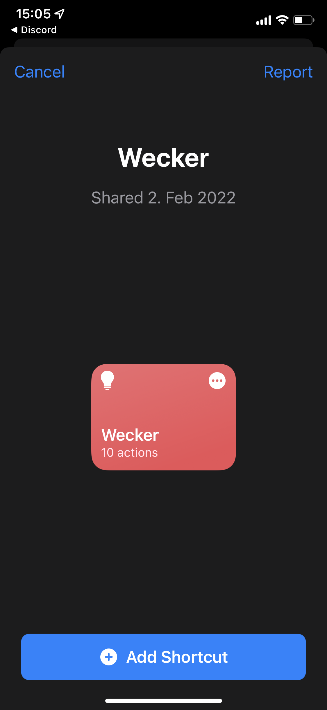

# SmartLight
This project takes place as part of our lecture "Integrationsseminar" at DHBW Mannheim.

The Team Members of this Project are:
- Ann-Kathrin Kälberer
- Canberk Alkan
- Dominic Viola

Matriculation numbers in no specific order: 3275561, 1044258, 5799502

## Description
This project focuses on the creation of a light alarm clock. It will integrate with pre-existing devices like a smartphone with a alarm clock capability. The purpose of the light alarm clock is to wake users naturally by first using ambient light and then ringing the alarm. 

The alarm clock functionality is applicable via two different applications. If you are using an iPhone the idea was to use the app "Shortcuts" (z. Dt. Kurzbefehle) for the alarm clock implementation. Another way of accessing the clock is via the web. So both Apple and Android devices are capable of using this functionality. For the web application any browser can be used.

The following list consists of the used tools to realize this platform.
- Raspberry Pi 4
- LED strip
- Adapter
- Power supply
- Jumper
- Plug-in board

The following software packages were used:
- Raspberry Pi OS -> Operating System of the Raspberry Pi 4. Used for development environment to directly communicate with the Raspberry Pi.
- Python -> This programming language is used to implement the logic for the GPIO Pins
- Flask -> Is used for the backend programming of the web server
- Shortcuts -> Is used to have an implementation of this platform in the form of a smartphone app (Apple devices only)


To measure the performance of the platform, functional and non-functional requirements were defined.


| Functional Requirements | Non-Functional Requirements |
| ----------------------- | --------------------------- |
| At a defined time, the light should turn on | Ease of use |
| Turn on/off the light | Effectiveness (Brightness of the light) |
| Set alarm clock time | Extensibility (Set many different alarms) |
| Control via smartphone | Functionality |


Tasks can be devided in
- Flask Webserver implementation: Ann-Kathrin Kälberer, Dominic Viola
- Logic of LED and GPIO Pins: Dominic Viola, Canberk Alkan
- Presentation and Documentation: Canberk Alkan 


## Implementation 
We use a Raspberry Pi 4 to controll a LED strip. (Any other Raspberry Pi model or an Arduino would also work, if you install a network antenna.) The Raspberry Pi hosts a REST API Server that exposes controlls for the LED Strip to the LAN. 

The alarm clock application of a Smartphone will serve as a trigger, that sends an HTTP request to the REST server.  


## Developer Notes

### Folders and Files

1. Folder: [Smart Light](smart_light)

Contains the flask webserver [app.py](./smart_light/app.py), that also exposes a REST API to set alarms through POST requests. It also contains the database [wecker.db](./smart_light/wecker.db) that stores alarms persistently. The logic to control the LED strip through the Raspberry Pi's GPIO pins is implemented in the file [led.py](smart_light/app.py).

> NOTE: You should change the line ```rgb_pins = (17, 22, 24)``` to the R, G, B GPIO-Pins that you connect your LED strip to.

2. File: [Wecker.shortcut](Wecker.shortcut)

This file can be imported to Apple iPhone and iPad to use it with the [Shortcuts app](https://support.apple.com/en-gb/guide/shortcuts/welcome/ios). Just download the file to one of those devices and open it. It will enable you to set your devices alarm clock to a specific time and it will also send a HTTP request to the API Server. Your devices alarm will ring together with the light alarm. 

<p align="center">
  
   
  
</p>


> NOTE: You need to change the IP-address inside the shortcut to the IP-address of the Raspberry Pi in your local network. (Run ```$ifconfig``` on your Raspberry Pi to get the IP-address.)

3. Folder: [Backend](backend)

The files to setup and modify a Flask REST server with user authentification.

The subfolder [/backend/scripts](backend/scripts) contains python scripts that help to debug the API server.

The [assets](assets) folder is meant for pictures and other materials that are included in this README.

> NOTE: This server is not used. We didn't integrate it into the main server, because the functional requirements had higher priority.


<br>

### Setup for the backend
Install the dependencies:
```bash
pip install -r requirements.txt
```

Start the server:
```bash
python smart_light/app.py
```
This should start the server that serves the website, control the LED strip, handle database interactions and check the database regularly for alarms that should be triggered.

