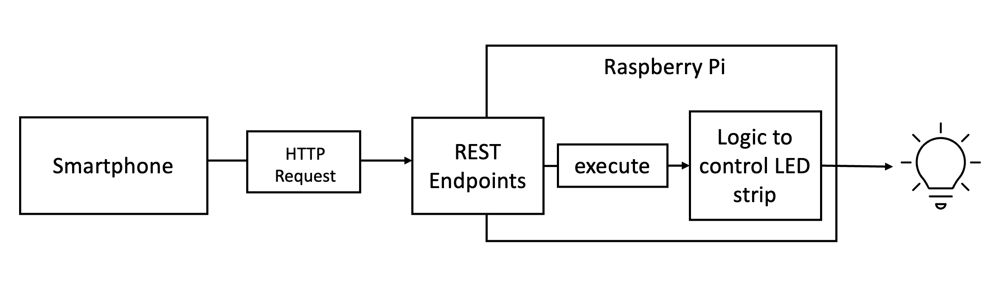

# SmartLight

## Description
This project focuses on the creation of a light alarm clock. It will integrate with pre-existing devices like a smartphone with a alarm clock capability. The purpose of the light alarm clock is to wake users naturally by first using ambient light and then ringing the alarm.

This project takes place as part of our lecture "Integrationsseminar" at DHBW Mannheim.

The Team Members of this Project are:
- Ann-Kathrin Kälberer
- Canberk Alkan
- Dominic Viola

## Implementation 
We use a Raspberry Pi 4 to controll a LED strip. (Any other Raspberry Pi model or an Arduino would also work, if you install a network antenna.) The Raspberry Pi hosts a REST API Server that exposes controlls for the LED Strip to the LAN. 

The alarm clock application of a Smartphone will serve as a trigger, that sends an HTTP request to the REST server.  



---
## Developer Notes

<br>

### Folders
The files to setup and modify the Flask REST server are in the folder [backend](backend).

The subfolder [/backend/scripts](backend/scripts) contains python scripts that help to debug the API server.

The [assets](assets) folder is meant for pictures and other materials that are included in this README.

<br>

### Setup for the backend
Install the dependencies:
```bash
pip install -r backend/requirements.txt
```

Start the server:
```bash
python backend/server.py
```
This should start the server and create the files ```.secret``` and ```secret_clear.txt``` the server will use those as a store for the server password.

##Website
Install the dependencies:
'''bash
pip install flask
pip install SQLAlchemy
